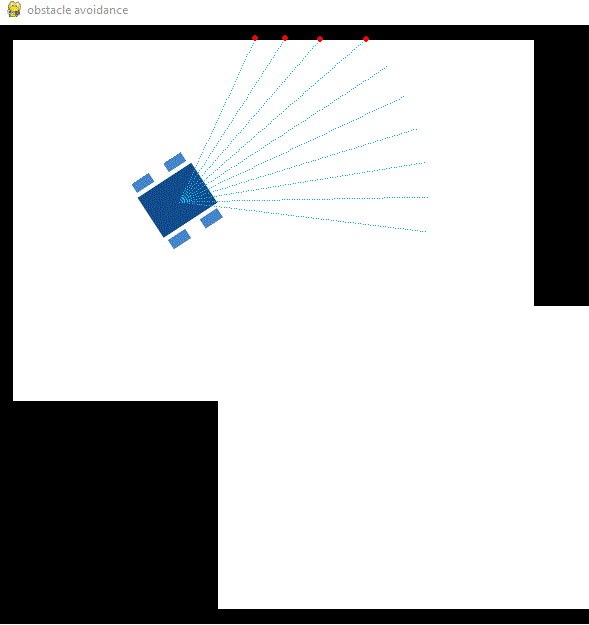
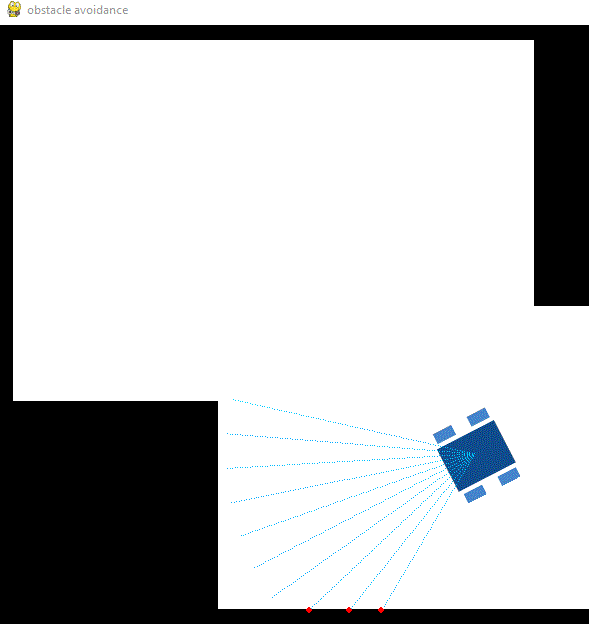

# 🤖 2D Robot Obstacle Avoidance Simulation

A Python-based 2D differential drive robot simulation with ultrasonic sensor-based obstacle avoidance, built with Pygame. The robot navigates autonomously through a map, detecting and avoiding obstacles in real time.




---

## 📌 Features

- **Differential Drive Robot (DDR)** kinematics model
- **Ultrasonic sensor simulation** with configurable range and angle
- **Real-time obstacle detection** via point cloud sensing
- **Autonomous obstacle avoidance** — robot backs up and steers away when an obstacle is detected
- **Visual sensor rays** rendered on screen (cyan beams)
- **Google Colab support** via headless display mode

---

## 🗂️ Project Structure

```
project-robot/
│
├── ROBOT.py                  # Core simulation classes (Robot, Graphics, Ultrasonic)
├── temp.py                   # Local runner script
├── google_colab_Code.ipynb   # Google Colab notebook version
├── DDR.png                   # Robot sprite image
└── ObstacleMap.png           # Environment/obstacle map image
```

---

## 🧠 How It Works

### Robot (`Robot` class)
- Uses **differential drive kinematics**: left and right wheel velocities control movement and turning.
- Implements `avoid_obstacles()`: if an obstacle is detected within `min_obs_dist` (180px), the robot moves backward with a countdown timer before resuming forward motion.

### Ultrasonic Sensor (`Ultrasonic` class)
- Casts **10 sensor rays** within a configurable angular range (±40°).
- Each ray samples 100 points; the first black pixel hit is recorded as an obstacle.
- Returns a **point cloud** of detected obstacle positions.

### Graphics (`Graphics` class)
- Initializes the Pygame window and loads the map + robot sprite.
- Renders the robot with correct heading rotation using `rotozoom`.
- Draws detected obstacle points as red dots on the map.

---

## 🚀 Getting Started

### Prerequisites

```bash
pip install pygame numpy
```

### Run Locally

```bash
python temp.py
```

### Run on Google Colab

1. Upload your project folder to Google Drive under `MyDrive/project-robot/`
2. Open `google_colab_Code.ipynb` in Colab
3. Run all cells (headless display is configured automatically)

---

## ⚙️ Configuration

You can tweak these parameters in `temp.py` or the Colab notebook:

| Parameter | Default | Description |
|---|---|---|
| `MAP_DIMENSIONS` | `(680, 1200)` | Height × Width of the simulation window |
| `start` | `(200, 200)` | Robot starting position (x, y) |
| `robot width` | `0.01 * 3779.52` | Robot wheel base in pixels |
| `sensor_range` | `250 px, ±40°` | Ultrasonic sensor range and cone angle |
| `min_obs_dist` | `180 px` | Minimum distance before obstacle avoidance triggers |
| `count_down` | `5 sec` | Duration of backward movement on obstacle detection |

---

## 🗺️ Map Files

| File | Description |
|---|---|
| `DDR.png` | Visual robot sprite (blue differential drive robot) |
| `ObstacleMap.png` | Black-and-white obstacle map (black = wall/obstacle, white = free space) |

> To create a custom map, draw a black-and-white image where **black pixels are obstacles**. Set its dimensions to match `MAP_DIMENSIONS`.

---

## 📸 Screenshots

| Sensor Detection | Obstacle Avoidance |
|---|---|
|  |  |

---

## 🛠️ Built With

- [Python 3](https://www.python.org/)
- [Pygame](https://www.pygame.org/)
- [NumPy](https://numpy.org/)
- [Google Colab](https://colab.research.google.com/) *(optional)*

---

## 📄 License

This project is open source and available under the [MIT License](LICENSE).

---

## 👤 Author

**Behnoud Shafizadeh**  
Feel free to fork, star ⭐, and contribute!
